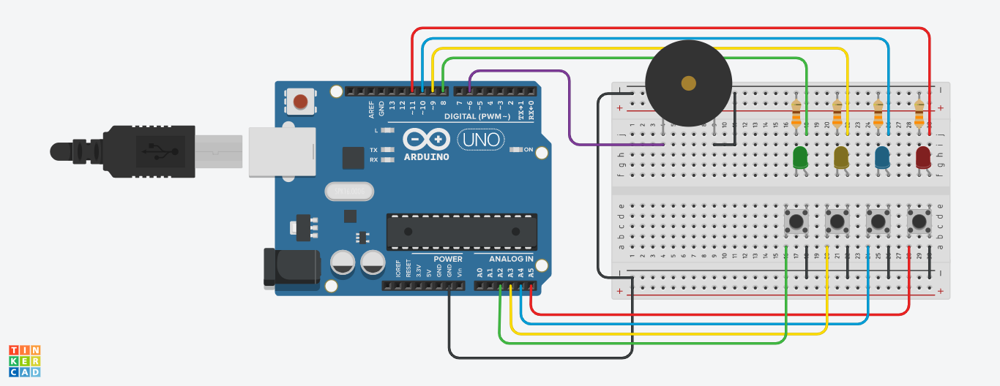
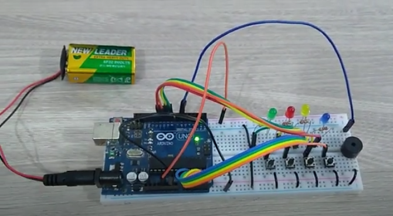

# Arduino Genius
Um jogo de memória do tipo "Genius" implementado no Arduino.

Para alterar o tamanho da sequência gerada, configure a linha ```#define game_size 		  20```

## Confira o projeto no [Tinkercad](https://www.tinkercad.com/things/lK6OhdzAJsQ)


## Confira um vídeo de [demonstração](https://www.youtube.com/watch?v=cDxtiRnfyAA)
